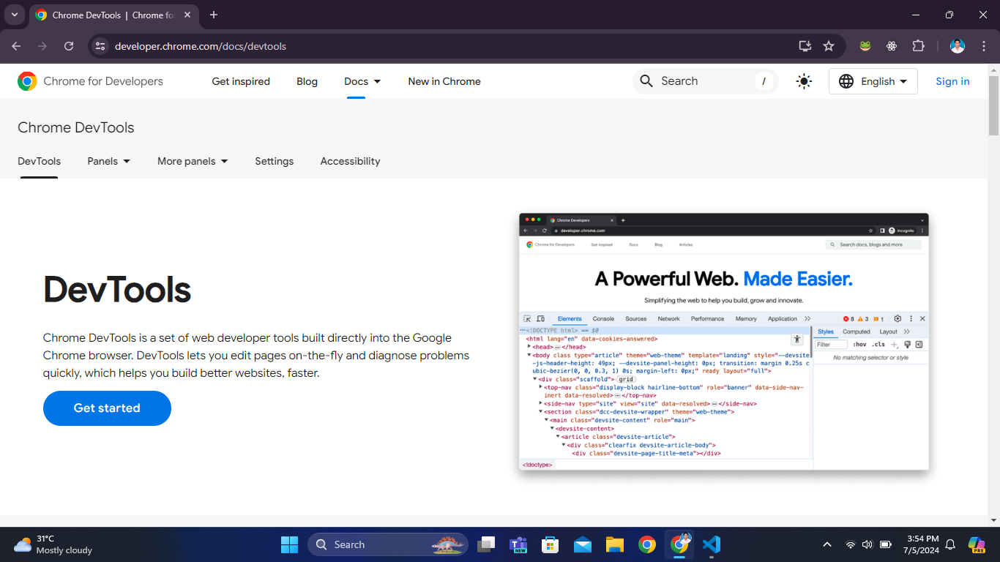
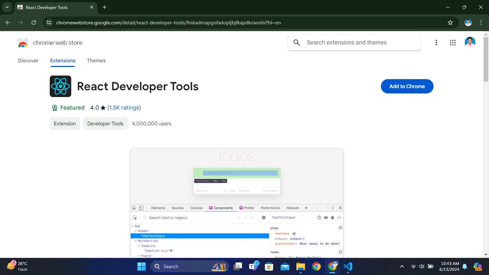
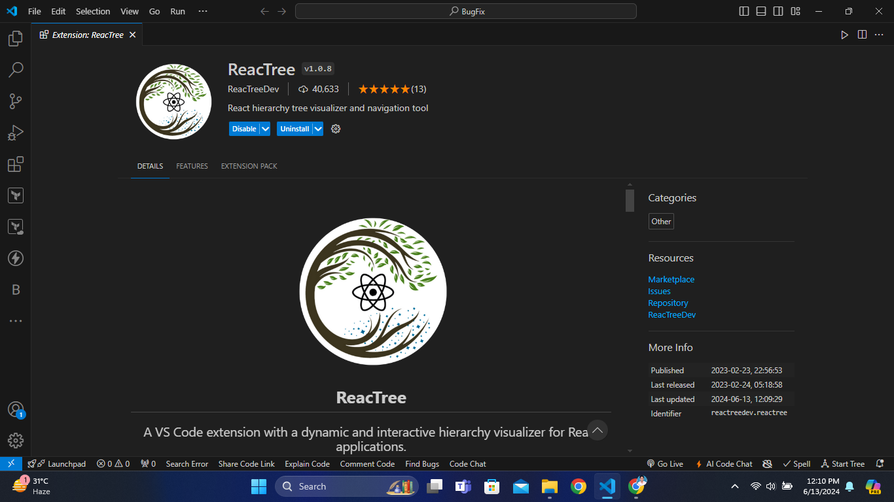
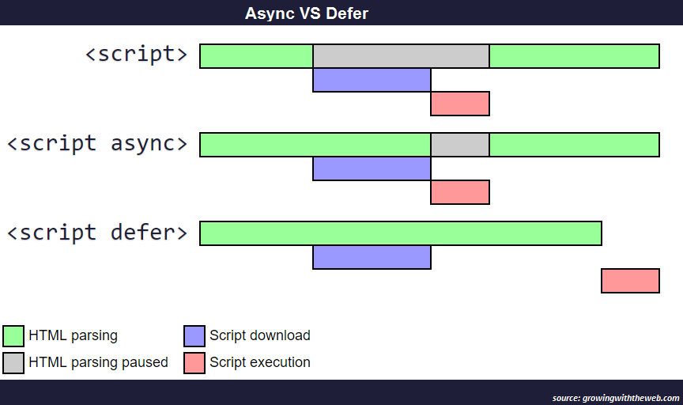

# Advanced React

<details>
<summary>Index</summary>

## Index

- Debugging
- Performance
- Optimization

</details>

---

<details>
<summary>Debugging</summary>

## Debugging

### Tools

1. Browser Developer Tools
2. React Developer Tools(Browser Extension)
3. Reactree (VScode Extension)

#### 1.Browser Developer Tools

- **Inspect Element**: Open your application in a web browser and use the "Inspect" tool (right-click on the UI element and select "Inspect").
- **Identify Component Name**: In the Elements panel, look for React-specific attributes like `data-reactid`, or `classes` and `ids` that might give hints about the component's name or structure.



#### 2. React Developer Tools

- React Developer Tools is an extension available for Chrome and Firefox that allows you to inspect the React component hierarchy in the browser's Developer Tools.

- It allows you to inspect the React component tree directly and see the component hierarchy and props.
- You can check particular Component State and Props.



#### 3. Reactree

- See the components hierarchy visually.



### Find UI code in codebase

1. Understand the Project Structure
2. Search the Codebase
3. Trace from Entry Points
4. Comments and Documentation

#### 1. Understand the Project Structure

```
src/
|--- Pages/
|    |--- Home/
|    |--- About/
|    |--- NotFound/
|--- Layouts/
|    |--- Header/
     |--- Footer/
```

#### 2. Search the Codebase

- Use IDE ty (like VS Code, WebStorm, or Sublime Text) with search functionality to search the codebase.
- Search by `className / id`: Search for unique classNames or IDs that you identified using the browser's Developer Tools.
- Search by Component Name: If you have an idea of the component name, search for the component definition (e.g., function ComponentName or class ComponentName).
- Search by Text: If the component renders specific text, you can search for that text string in the codebase.

#### 3. Trace from Entry Points

- Start from `App.js`: Look at App.js or the main entry point of your application to see how components are structured and routed.
- Check Routing Configuration: If your project uses a router (like react-router), check the routing configuration to understand how different pages and components are connected.

#### 4. Comments and Documentation

- Check for any comments in the code or project documentation that might help you understand the component structure and functionality.

### Example Workflow

1. Identify the Element:
   Suppose you need to change a button in the header. Use the browser's Developer Tools to inspect the button element.

2. Locate the Component:
   Note any unique identifiers (e.g., classNames). Use your text editor to search for these identifiers in the `src/components/Header` directory.

3. Trace Imports:
   Find the component file, then trace back to see how it’s imported and used in the project.

4. Make the Change:
   Once you’ve located the correct component, make the necessary UI changes.

5. use **debugger** keyword to find problem in step by step.

- Debug Documentation: https://dev.to/colocodes/how-to-debug-a-react-app-51l4

</details>

---

<details>
<summary>Performance</summary>

## Performance

- Performance Importance
- Performance Measuring Tools

### Performance Importance

1. User Experience (Happy Users):A fast site keeps users engaged and coming back.
2. Tasks Done Faster: Users get things done quicker with smooth performance.
3. Customer Satisfaction: Quick and reliable performance leads to happier customers, reducing frustration and increasing loyalty.
4. Revenue & Profitability (More Sales): Improved performance can boost conversion rates, leading to higher sales and increased revenue. Faster sites convert visitors into customers.
5. Operational Cost (Lower Costs): Efficient performance reduces server load and bandwidth usage, lowering operational expenses. Efficient sites save on server resources.
6. Competitive Advantage: Superior performance can set a product apart from competitors, attracting and retaining more users.
7. Google Ranking: Google considers site speed and performance in its ranking algorithm, so better performance can improve search engine visibility.


#### Examples :

1. Video Streaming: Playing a 20GB video on a website results in the client using 20GB of bandwidth, which can be costly and impact network performance.
2. Asset Downloading: If assets like images and scripts are downloaded every time a component renders, it leads to unnecessary data transfer, increased load times, and higher server strain.

### Performance Measuring Tools

- Browser Developer Tools

#### Browser Developer Tools -> Developer Mode

Check These in Incognito Mode

1. Network Tab
2. Lighthouse
3. Performance Tab

- https://www.freecodecamp.org/news/measure-and-improve-performance-of-react-apps/

### Production Application Performance Measuring Tools

- CrUX -> Chrome User Experience
- PageSpeed.web.dev
- requestMetrics.com
- clarity.microsoft.com
- NewRelic
- Sentry
- Google Analytics

</details>

---

<details>
<summary>Optimization</summary>

## Optimization

1. Network Optimization
2. Asset Optimization
3. React Optimization
4. Build Optimization

### Network Optimization

1. loading Javascript using `async` & `defer`
2. Loading images using `lazy` & `eager` - Lazy Loading
3. Caching using service worker
4. Critical Rendering Path
5. Fetch Priority

#### 1. async & defer

Loading a webpage involves three steps :

- HTML Parsing: The browser reads the HTML code and creates a structure (DOM).
- Script Download: When it encounters a `<script>` tag, the browser downloads the script file.
- Script Execution: Once downloaded, the browser executes the script code



- HTML Parsing Paused:
  This occurs when the browser encounters a `<script>` tag in the HTML. The browser stops parsing the HTML temporarily to fetch and execute the script. This can delay page rendering.

- Async:
  `<script async src="script.js"></script>`
  If the `<script>` tag includes the async attribute, the script download is initiated without pausing the HTML parsing. The script is executed as soon as it's downloaded, regardless of whether the HTML parsing is complete. Executes as soon as downloaded, independent of other scripts.

- Defer:
  `<script defer src="script.js"></script>`
  If the `<script>` tag includes the defer attribute, the Script downloads without pausing parsing. Executes only after HTML parsing is complete, in the order scripts appear.

```js
<script src="index.js"></script>
<script async src="index.js"></script>
<script defer src="index.js"></script>
```

#### 2. lazy vs eager

- Lazy loading: This means resources like images, scripts, or data are only loaded when they are needed. For example, in a web page, images that are below the fold (not immediately visible) might load only when you scroll down to see them. It helps save initial loading time and resources.

- Eager loading: This is the opposite. It loads all resources right away, as soon as the code or page starts executing. For instance, a web page might load all images and scripts immediately when you open it, regardless of whether you actually use or see all of them right away. This can make the initial load time longer but ensures everything is ready when needed.

</details>

---
